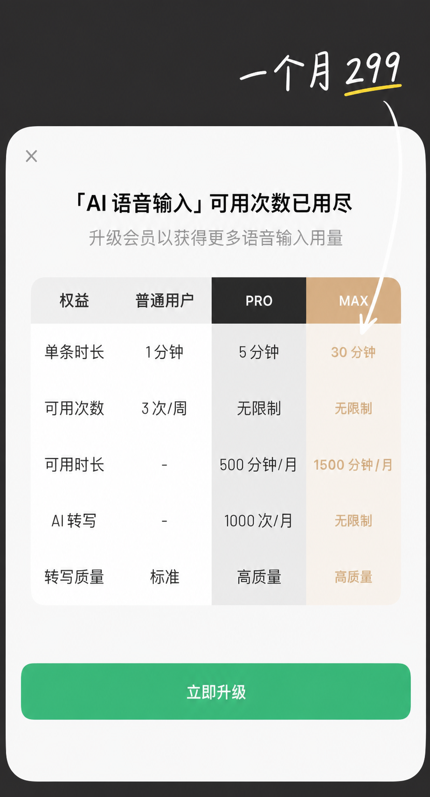
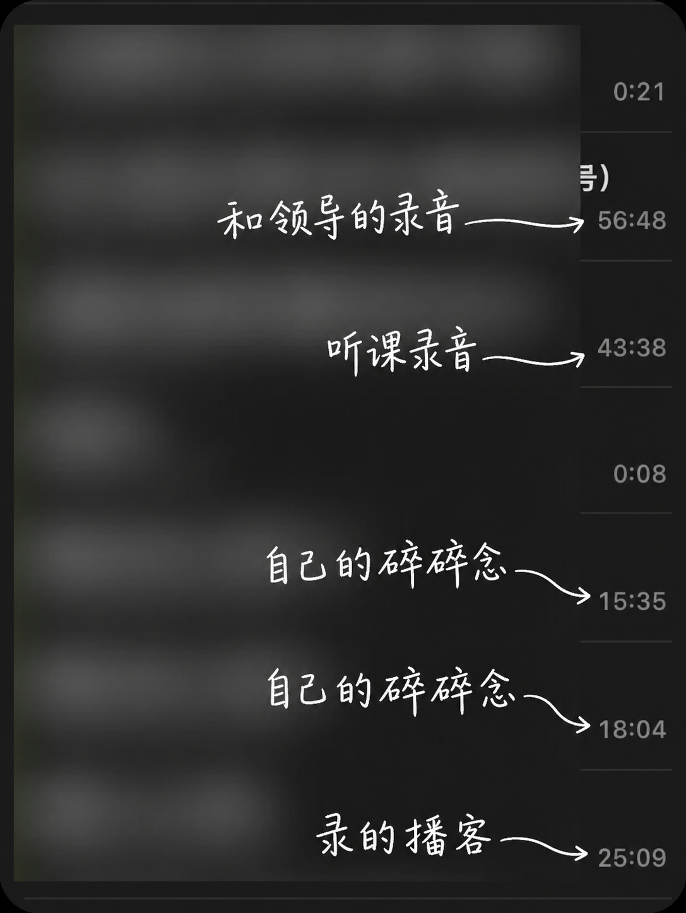
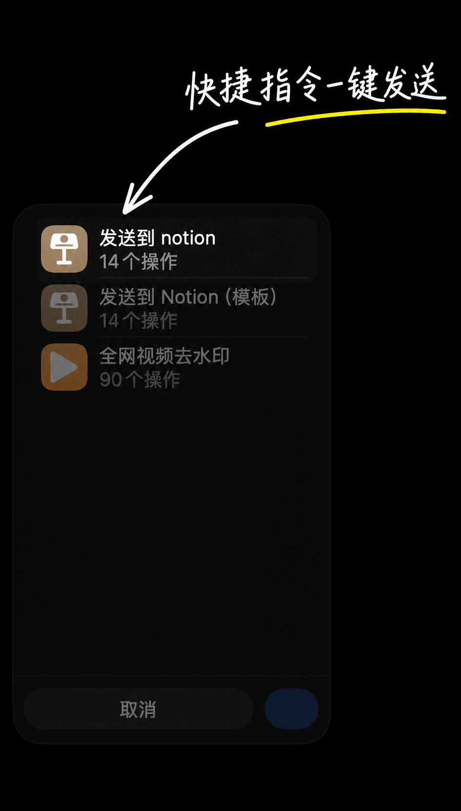
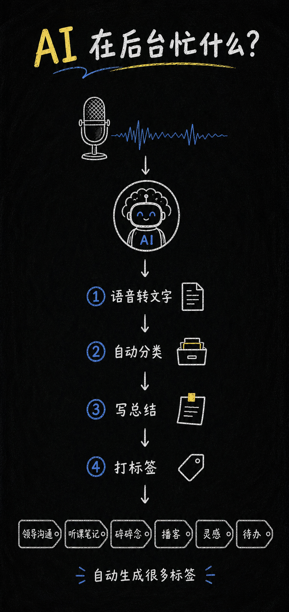
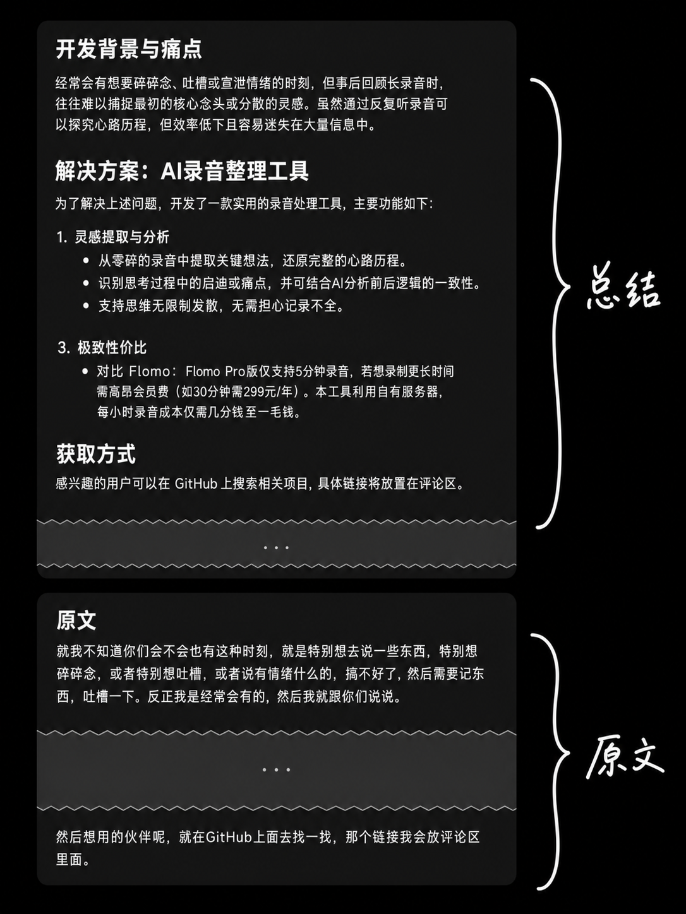
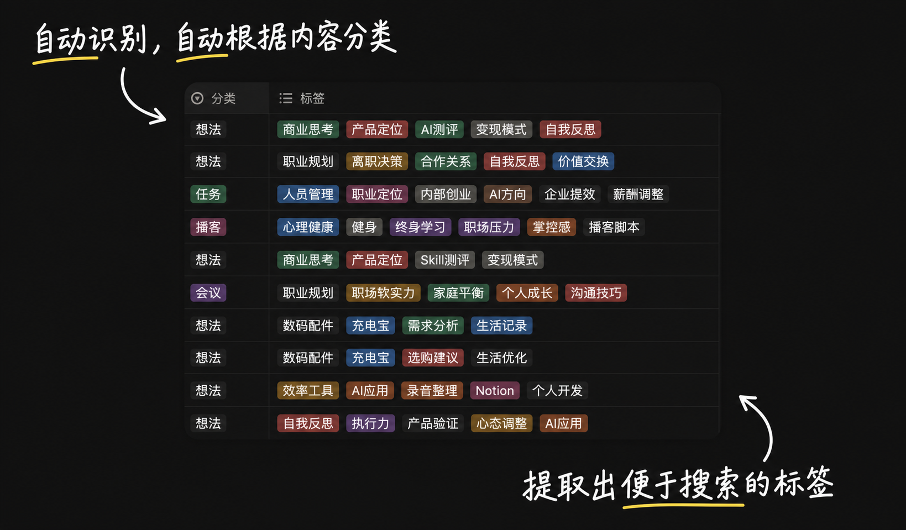
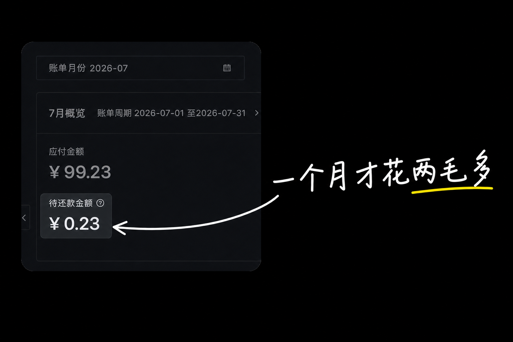
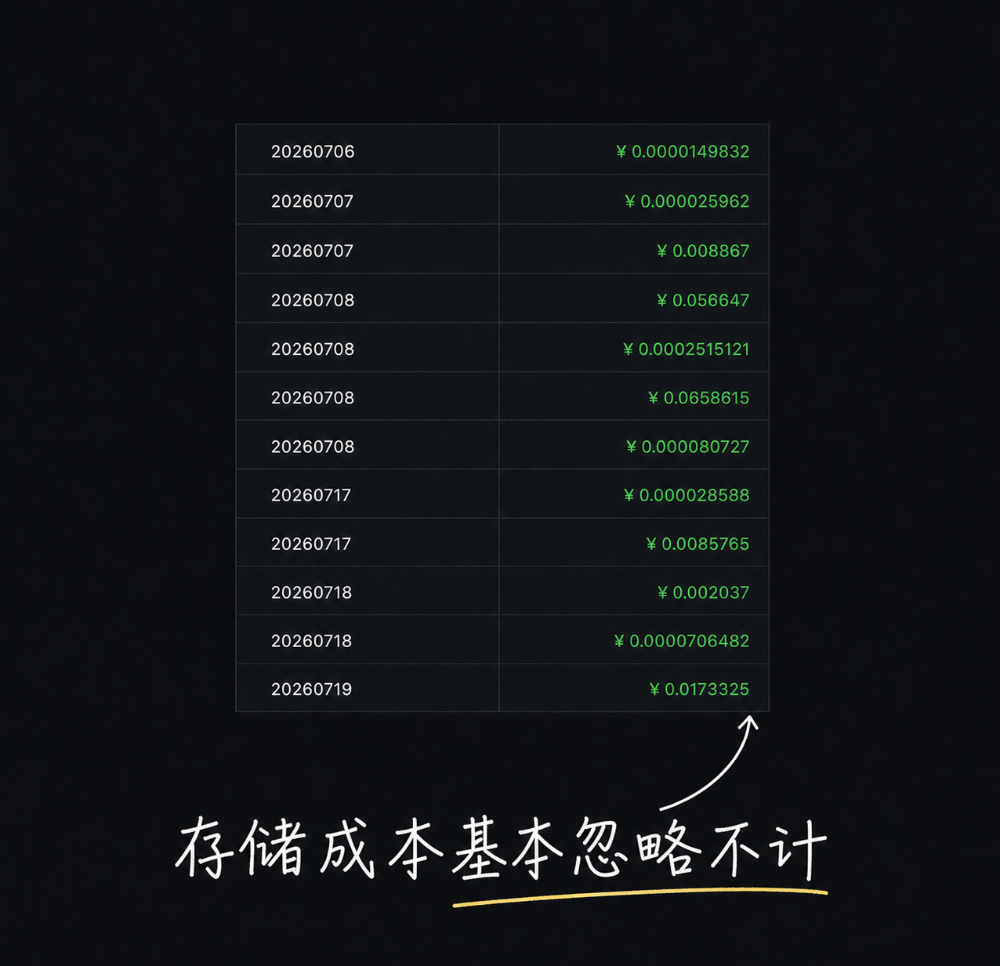

不知道大家平时语音转文字都在用什么。我用过 flomo 和夸克，后来都淘汰了。

## 先说痛点

flomo 最多能录三十分钟，结束之后自动帮你转成文字。很方便，但很贵——免费版一周只能录 3 条、每条 1 分钟，想用得爽就得开会员。

后来我切到了夸克。它有个功能叫「录音纪要」，应该还在内测，完全免费而且不限时长，很好用，但入口藏得非常深。好在夸克支持导入音频，所以我的用法变成了：随手用苹果语音备忘录录，想起来再导进夸克。

我最喜欢它转写之后自动生成的总结和标签。录音太长的时候，转成文字也不想看，扫一眼总结就知道自己当时想表达什么。它还能提取关键词，这个很有用——因为我的录音场景特别杂：

和领导的谈话、听课、播客、还有大量自己的碎碎念，从八秒到一小时都有。打上标签之后搜起来就容易多了。

**但夸克的问题是：这些总结和关键词导不出来。** 它们只能待在夸克里。我想把它们整理进自己的笔记软件，没有任何办法。

所以我一直有个念头：能不能让 AI 自动把录音转成文档，识别出它是什么类型（灵感、谈话、听课），然后分类进我的笔记库。正好前段时间攒了一堆录音，就咬咬牙花了一天，搓了个自己能用的版本。

## 用起来是什么样

录完音，在系统分享菜单里点一下快捷指令，就结束了。

剩下的全自动。等几分钟，Notion 里就有了。

服务器在后台依次做四件事：语音转文字、自动分类、写总结、打标签。最后存成一篇 Notion 文档，包含标题、摘要、分类、标签和完整原文。

## 三个我觉得最值的地方

### 一、分类是稳的

如果直接让 AI 自己决定分类，其实很不稳定。同样类型的录音，这次叫「思考」，下次变成「灵感」，再下次又是「想法」。每个看起来都有道理，但时间一长分类就烂了，根本没法管理。

所以我做了个机制：**你在 Notion 里预设好几种分类，每次上传录音，AI 只能从这些分类里选一个。**

分类不够用了随时加，AI 会实时读取最新的分类列表——**不需要改代码，也不需要重新部署**。这样每段录音都能落进你设定好的体系，不会再自己造出一堆乱七八糟的类别。

### 二、总结比我预期的好

有一次我上传了一段两个人的对话，没告诉它任何背景。结果它不仅判断出这是一期播客，连嘉宾的名字都识别出来了。

总结的价值在于：录音原文往往又长又散，逻辑不清晰，事后根本不想看。而总结能把它压成几条清晰的要点。

更重要的是，**它把「录音」这件事解放了出来**——你不用再纠结待会儿怎么整理、怎么组织语言，可以随便说。哪怕二十分钟里交叉讲了好几个主题，AI 也能识别出来分开处理。

### 三、价格

我这个月转了几个小时的录音，大家猜猜花了多少钱。

**两毛三。**

明细在这里，拆到每一笔甚至不到一厘：

而且这两毛三主要还是存储费用——大模型那部分基本没花钱，因为平台送的免费额度我才用掉一小部分：

照这个消耗速度，光免费额度就够处理二十来个小时的录音。

看到这个成本之后，我再回头看市面上一些产品的定价，只能说利润空间确实不小。**AI 时代，会一点开发真的能省下不少钱。**

## 一些说明

这个工具是**自部署**的，所有云服务都用你自己的账号，音频和文本只经过你自己的服务器和存储桶。

需要准备的东西：一台**公网可访问**的服务器（否则手机在外面发不进来）、一个阿里云 OSS 存储桶、一个百炼 API Key、以及 Notion 的集成。README 里有完整清单。

出口也不一定是 Notion。Obsidian、本地文件都可以接——Notion 只是我个人的习惯。

源码已经开源：[chaoliu719/stt-to-notion](https://github.com/chaoliu719/stt-to-notion)，跟着 README 就能自己部署一套。我也提供了 Notion 模板，点右上角 Duplicate 直接复制走，不用手动配属性。

自己部署确实有点折腾。如果用的人多，我会考虑做成一个开箱即用的在线服务。
